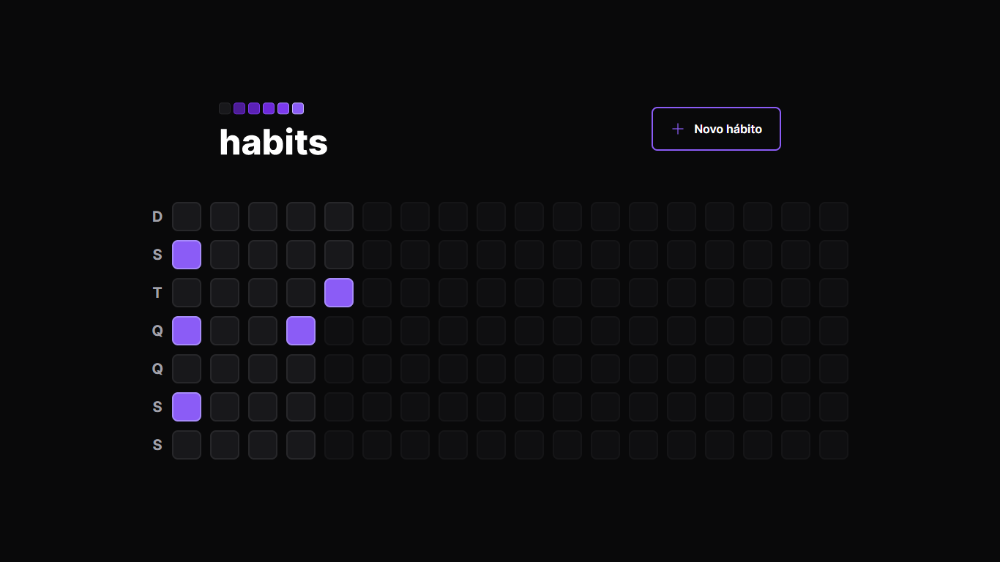

  
  
  

## 💻 Projeto

O "Habits" é uma aplicação de controle de hábitos, onde o usuário clica no quadrado que representa o dia atual e marca os hábitos cumpridos naquele dia. Desenvolvida com os conhecimentos passados no NLW Setup - Trilha Ignite.

## ✨ Tecnologias e features

### 🎨 Web

- [x] Vite
- [x] ReactJS
- [x] Typescript
- [x] TailwindCSS
- [x] RadixUI
- [x] Axios
- [x] Phosphor Icons

### ⚙️ Server

- [x] Node.js
- [x] Typescript
- [x] Prisma
- [x] Fastify
- [x] SQLite

## 📄 Licença

Esse projeto está sob a licença MIT.
